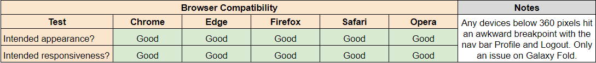
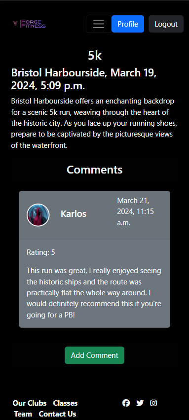
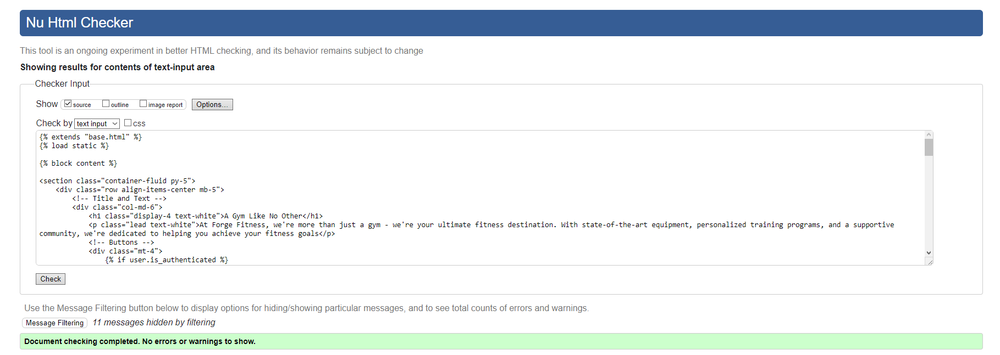
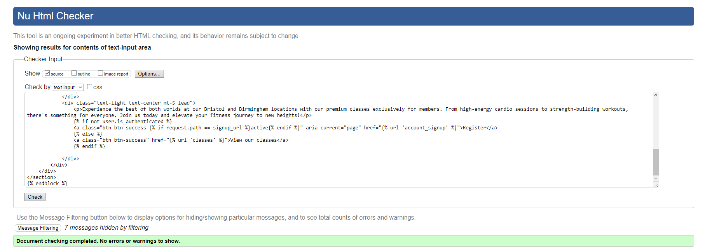

# Forge Fitness (Capstone Project)

[ForgeFitness](https://forge-fitness-abbd672aefb0.herokuapp.com) is a website that provides information about the gym, its locations, classes and staff to potential clients that wish to join their gym service. The overall goal of the site is to increase awareness of the brand and create a community, which would provide both monetary  and intangible value such as reputation in the businesses future. 

## Table of contents

* [Purpose](#purpose)
* [UX Design](#ux-design)
  * [User Stories](#user-stories)
  * [Structure](#structure)
* [Wireframes](#wireframes)
* [Design](#design)
* [Agile Development Plan](#agile-development-plan)
* [Database](#database)
* [Features](#features)
  * [Future Features](#future-features)
* [Testing](#testing)
  * [User Story Testing](#user-story-testing)
  * [Manual Testing](#manual-testing)
  * [Automated Testing](#automated-testing)
      * [Code Validation](#code-validation)
      * [Lighthouse](#lighthouse)
* [Technologies](#technologies)
  * [Languages](#languages)
  * [Programs Frameworks Libraries](#Programs-Frameworks-Libraries)
* [Deployment](#deployment)
* [Credits](#credits)

# Purpose
This website was designed as a capstone project for the Code Institute's Full Stack Developer Bootcamp. In keeping with Code Institute's Learning Objectives, this ReadMe covers both the development process for other developers understanding as well as sign posting where Learning Objectives have been met. 

# UX Design
## User stories
Target Audience:

- Fitness Beginners who are looking for their first gym that will provide a friendly and proffesional service.
- Athletes who are already committed, but need the neccessary equipment to train. 
- Personal Trainers who are looking for work that see an opportunity to join the gym and create their workflow.

The first two types of users are currently catered for within the scope of the website. The third, Personal Trainers, would require an admin to provide them with staff priviliges to create their gym classes for other users to view. 

### As a **first time user:**

- I want to be able to navigate the entire site regardless of device
- I want to create an account to interact with the site
- I want to easily log out and log back in
- I want a visual cue that after interacting with the site, something has happened
- I want to be able to navigate to all pages easily
- I want content that is only available to registered users 
- I want content that helps build the brand or business
- I want to view the gym classes 
- I want to comment and review the gym classes 
- I want to mark myself as attending gym classses
- I want to delete comments and reviews
- I want to be able to edit my profile to my liking
- I want to be able to delete my profile
- I want to pick the level of membership I want
- I want visual clarity/cues for when I am logged in or out
- I want to contact your business easily

### As a **returning user:**

- I want my data to be secure
- I want to check my profile & setting details easily
- I want to update my profile or settings if needed
- I want to delete my profile if needed
- I want to be able to reset my password 

## Structure

For this section, each page will have a screenshot, a rationale for the page  & the user stories (where applicable) covered by the page.

**Rationale:**

This page serves to provide the user with the purpose of the site, a hub to direct users around the site after forms and signposting that we want users to register.

**User stories covered:**
- I want to be able to navigate the entire site regardless of device  *Fulfilled by Nav bar and Footer*
- I want a visual cue that after interacting with the site, something has happened  *Users will be redirected here with a message alert with the event success or failure*
- I want content that is only available to registered users *The Login and Register Buttons will alternate to Profile/Logout and Profile Picture on larger screens*
- I want visual clarity/cues for when I am logged in or out *The Login and Register Buttons will alternate to Profile/Logout and Profile Picture on larger screens*
- I want to pick the level of membership I want *Future Feature - Users have the cards available with the memberships. If an ecommerce model was added, the HTML template is ready*

**Rationale:**

This page serves to provide the user with information on premium services that are on offer for members alongside an output for Personal Trainers for the gym classes they host.

**User stories covered:**
- I want to view the gym classes *Each post will be visible regardless of user authentication*

**Rationale:**

This page serves to provide the user with additional information on that specific gym class and interacting with other users. In future I would like this page to record attendance and allow Personal Trainers to show their team credentials and information. 

**User stories covered:**
- I want to comment and review the gym classes *When logged in, a "Add Comment" button will appear. All comments are visible to users!*
- I want to delete comments and reviews *An Edit/Delete button will appear if the user who made the comment is logged in*
- I want content that is only available to registered users *The Create/Edit/Delete is only available to registered users*

**Rationale:**

This page serves to provide the user the option to register with the website

**User stories covered:**
- I want to create an account to interact with the site *Upon providing the information requested, a User will be created alongside a Profile*
- I want my data to be secure *Using Form Validation from Django for password which will encrypt your information* 

**Rationale:**

This page serves to provide the user the option to login to the site.

**User stories covered:**
- I want to easily log out and log back in *A quick login page and Logout will redirect you to the homepage in a logged out state*

**Rationale:**

This page serves to provide the user with additional aspects of their profile they can edit. This allows users to stand out with their profile pictures, alongside basic details for the gym to hold. 

**User stories covered:**
- I want to be able to edit my profile to my liking *Users will be prompted to fill this in after the base User form. You can edit this to your liking*
- I want a visual cue that after interacting with the site, something has happened *Users will be redirected to homepage with a message alert with the event success or failure*

**Rationale:**

This page serves to provide the user with the ability to edit your registration information in the event of a mistake or needing a change. 

**User stories covered:**
- I want to be able to reset my password *Users can change their password here, assuming it is a valid format while logged in. Other users cannot access this area as it is specific to your logged in user*
- I want to update my profile or settings if needed *Settings can be changed here for first name, second name, username, password and email* 
- I want a visual cue that after interacting with the site, something has happened *Users will be redirected to homepage with a message alert with the event success or failure*

**Rationale:**

This page serves to provide the user with a hub for everything about their profile in a private area. In the future, I would like this to include a users membership information and the ability to change their finanical information. 

**User stories covered:**
- I want to be able to edit my profile to my liking *Users will be prompted to fill this in after the base User form. You can edit this to your liking*
- I want to be able to delete my profile *Takes the user to a delete profile page where they confirm the deletion*
- I want visual clarity/cues for when I am logged in or out *The Profile page and edit sections are only available to logged in users*
- I want to delete comments and reviews *IF a user deletes their profile, all comments/reviews will be deleted as well*
- I want to check my profile & setting details easily *Users will see a basic rundown of their information on the page*
- I want a visual cue that after interacting with the site, something has happened *Users will see the changes from their settings/profiles here*

**Rationale:**

This page serves to provide all users with an easy way to communicate to the business with any queries. 

**User stories covered:**
- I want to contact your business easily

**Rationale:**

These pages serves to provide users with additional information to build trust, ultimately resulting in a user converting by registering. In future, they would be interlinked with the gym classes provided with the respective locations and staff information running the class.

**User stories covered:**
- I want content that helps build the brand or business

# Wireframes

My wireframes were my rough initial designs. I have made alterations to the templates to benefit user experience when using the site depending on their device or my own limitations with time and implementation after my first meeting with my tutor. For example, removing profile pictures on mobile due to the condensed and busy design or Classes with functionality. 

For wireframes intended purpose, I have tried to stay as close as possible to the initial ideas. Any other pages are built using All Auth's base templates or developed using the base.html that is shown via the home page wireframe. 

### Home Page 

click to expand

### Our Clubs

click to expand

### Classes 

click to expand

### Team

click to expand

### Profile

click to expand

# Design

The website is intended to have a simple layout with emphasis on clean, readable designs. 

During the initial planning stage of the project, I settled on the following: 

- A black background.
- White text to compliment the black background.
- Using btn-success (Green) for Register and btn-primary (Blue) for Profile as an easy visual cues for users.
- Bootstrap for layout of pages. This is due to my familiarity with the frontend framework over other available frameworks.
- Default text fonts provided by Bootstrap. This is due to accessability and usability while being practical with time.
- The logo colours and typography can be found in this document: 

click to expand

The intention behind these choices are to create a modern, trendy website that fits the rural/techno vibes of the locations while also appealing to athletes as it does what it says on the tin without needing to make bold design choices. A simple, clean design!

# Agile Development Plan

Utilising an agile methodology, I have used MoSCoW prioritization within a Github project kanban board to track user stories and features. This approach enabled me to develop the Minimal Viable Product early on and then begin to prioritise my time within the project to the absolutely neccassary features for users. 

I used the following:

- Must-Have
- Should-Have
- Could-Have
- Won't-Have
- Feature (This was an extra to help identify features vs user stories criteria)

The development cycle over the course of this project has allowed me to cover the majority of user stories (Done Section), however some remain as future features (Future features section) such as attendance, e-commerce intergration and staff setting up gym classes which provides their details. As I have been working, I was slowly progressing the User Stories across the project board from Todo and In Progress respectively. (Admittedly I could have and likely should have used this more as the project expanded, future learnings for myself!)

[See the project here.](https://github.com/users/Karlsberg62/projects/6)

# Database

This is my initial database model. 

During development, changes were made as I improved my understanding of the database requirements and documentation of technologies I used. 

- It became impractical to connect the Profile and Comments/Review tables. One connection from User table to Comments was enough rather than passing through two tables.
- The slug FK for comments/review was impractical, it is far easier to connect the two tables by a post name so that each comment is associated with a specific session.
- Removing the image from Comments/Review, this table did not require this information if it already exists in another table that is also being called to the specific session.

Other than these changes, the majority of alterations have come from form validation on my models in regard to phone numbers, passwords and picture uploads using various technologies.

# Features

Please see the [UX - Structure](#structure) for screenshots of the pages containing the features. Any pages not previous screenshotted are provided. This section covers each feature and the choices made behind the feature.

### Register/Login/Logout

- Using Django All Auth, the project includes the ability to handle user creation, authentication and the ability to authorise users. Using the standard User form, amplified by crispy forms and bootstrap, alongside adding fields for first name and second name creates our first step to registering. 

- Upon registering, Users are redirecting to the edit_profile page to add additional details. This step is intentional to make it seem like the transition is one process in lue of using custom forms. Users are able to skip this step if they wish as the details are not important for functionality on the site, they are purely for users ability to express their individuality and potential future features on membership.

### Navbar

- A key feature, the nav bar. This feature is on every page and will always remain pinned to the top of the page regardless of page size or content to allow users easy navigation around the site and to reinforce the visual cues about the users status. The brand logo is a permanent fixture on the screen at all times assisting with the goal of building our intangible values (Reputation, Trust etc) with the user. 

### Footer

- An extension of the nav bar. This echos many of the design choices, however this includes social links for potential points of contact for users. If these links were to the brand social accounts, this would be aimed at assisting our intangible values as well as driving users to conversion by registering on the site alongside our other social platforms. 

### Messages

- Each feature that allows users to interact with the site (Profile, Sessions, Comment Review) will redirect to the home page and provide a success or fail message to the user. This is an important user experience because this approach ensures consistency, simplicity, enhancing usability and reducing confusion.

click to expand

### Gym Classes (Sessions model)

- Based on the classes page, this feature showcases each Session available to users. Each session would be hosted at one of our locations, with basic details on what it is, where and when. Users can interact with the sessions via comments and reviews. In future features, it is intended that users would have greater interaction in the form of attendence and staff details. 

- Admins or Staff approved accounts can create sessions while Anonymous users and Authenticated Users can read the sessions. Only Authenticated Users will see options to create/edit/delete comments and reviews.

### Comments (Comment Review model)

- Only Authenticated users will see options to create/edit/delete comments and reviews. Furthermore, Authenticated users can only edit or delete their own comments as this feature is tied by the username executing the event.

### Profile (Profile model), Edit Profile & Settings

- The Profile feature is optional. Authenticated users can choose to ignore this step if they wish, however the profile picture ties in with users comments allowing greater personalisation. Again, this is aimed at users feeling part of a community. 

- The Profile page is only available to authenticated users and will only show your individual details. If a user logs out, the profile page will become unavailable. If a user logs in on multiple browsers or devices, the page will only show the details & ability to edit/delete the profile that is logged in on that specific browser or device.

- The settings page is a re-creation of the User form that allows authenticated users the ability to make changes if mistakes were made in registration. 

### Delete

- Authenticated users have the ability to delete their Profile. This opens a seperate page that checks if the user really wants to do this. If the user chooses to delete their account, this will remove all posts, comments reviews alongside their User & synced Profile data.

- This feature was provided as part of CRUD and on the other hand, a prevention for users accidentally pressing the button.

click to expand

## Future Features

These features were considered, but due to the short timeframe in development were delayed for future deployments.

### Membership and E-commerce

- Adding membership options for Users during Registration via custom forms integrated with the default User form. This would capture a choice (Similar to Gender in Profile) that would then connect to the e-commerce table, widget or software that would securely contain their financial information, process the initial payment and output the membership option chosen to the Users Profile. 

- The idea behind this being that Users may want to alter their financial information, amend their level of membership and would also allow the business to offer content based on membership levels. (For example, all locations available to Monthly users, but not daily, discounts or gym session limits)

### Attendence & Staff Details

- Adding an attendance feature to the gym sessions session details that would allow users to virtually signal that they will attend, provide their profile information to the staff member running the session and set a maximum attendance. The idea behind this feature would be allowing greater interactivity, providing more information to users and ultimately improving the user experience of our service.

### Profile Extras

- Adding room in the Profile page for a history of comments or classes attended. This would allow users to easily go back to a classes session details and add a review alongside talking with other users if they can see a history of the comment sections they have been involved in. 

# Testing
## User Story Testing
| Expectations | Realisation |
|-|-|
| I want to be able to navigate the entire site regardless of device | The website is fully responsive and accessable on all screen sizes, tested via Chrome dev tools |
| I want to create an account to interact with the site | The user can register to the site |
| I want to easily log out and log back in | Authenticated users can press logout, then login and enter their username/password to log back in |
| I want a visual cue that after interacting with the site, something has happened | Messages appear for all events on the website |
| I want to be able to navigate to all pages easily | A navbar and footer are present in the same location on all pages |
| I want content that is only available to registered users | The Profile, Comments Reviews are only available to registered users |
| I want content that helps build the brand or business | Clubs, Classes, Team are all available for additional content for all users  |
| I want to view the gym classes | All users are allowed to read the gym classes and view their details |
| I want to comment and review the gym classes | Upon registering, users can add, edit & delete their comments review on any gym class page  |
| I want to mark myself as attending gym classses | A future feature that was not implemented on this deployment |
| I want to delete comments and reviews | Upon registering, users can add, edit & delete their comments review on any gym class page |
| I want to be able to edit my profile to my liking | Upon registering, users can  edit & delete their Profile or User settings |
| I want to be able to delete my profile | Authenticated Users can click the delete profile button and then delete their profile by confirming via the button on the page | 
| I want to pick the level of membership I want | A future feature that was not implemented on this deployment |
| I want visual clarity/cues for when I am logged in or out | A message will appear for events including logging in or out alongside buttons changing on navbar |
| I want to contact your business easily | A simple contact form was implemented for all users on the Contact page |
| I want my data to be secure | Form validation for passwords, emails and phone numbers alongside Django security has been implemented |
| I want to be able to reset my password | Users can amend their passwords on the edit settings page or use the Reset Password on the login page |

## Manual Testing

### Responsiveness

- Tested on Chrome, Edge, Firefox, Safari and Opera via Desktop. 
- Using Chrome Developer Tools with all options available where possible, an issue was noted on Galaxy Fold for all browsers. Overall, still passing with Good as everything else worked as expected.
- Screenshots tested with Chrome Developer Tools on the following: iPhone SE, Pixel 7 & iPad Mini
- Testing on the following pages in this order: Homepage, Classes, Class Details & Register 

- iPhone SE:

click to expand

click to expand

click to expand

click to expand

- Pixel 7

click to expand

click to expand

click to expand

click to expand

- iPad Mini

click to expand

click to expand

click to expand

click to expand

### Manual Tests

## Automated Testing

### Bugs

- Profile Picture default URL using HTTP
  - Solved by changing the default URL in the Model Field with an image I have preloaded using a HTTPS url. Previously the uploads were being switched from HTTP to HTTPS by the browser automatically. This was tanking my performance score with Lighthouse testing.

- Profile Picture positioning 
  - Profile Picture on logged in users using Mobile caused the NavBar breakpoint to change. The Profile/Login and Profile Picture would drop below the nav bar causing an issue for the UX. This was solved by not showing the Profile Picture on devices below the Bootstrap medium screen size. 

- Footer positioning
  - The footer would typically sit just below the content on the page causing an issue on desktop that the footer was too high on the page. To fix this, I used `fixed-bottom`. Unfortunately, the mobile footer would break and hide buttons on the page when using this bootstrap class. So as a work around, I have added a media query for Desktop versions of the footer to move it to the bottom of the page, while removing `fixed-bottom` so the mobile version works as intended.

- Reset Password Form
  - Currently this bug still exists in the live version. After submitting the form, you will get an error as the AllAuth form broke, I believe this is potentially due to my custom form amendments. The page will still load. 

- Password Help Text Colour
  - Within the form for Users, there is text for password creation. This was always staying as dark despite adding `text-light` class to its container. To combat this, I have used the developer tools and located the ID associated with the password text. I have assigned priority to my css ID and amended the text colour. 

### Code Validation

- HTML

- Any Python/Django related issues detected are being filtered (For example, href attributes)

Homepage

click to expand

Our Clubs

click to expand

Classes

click to expand

Classes Details

click to expand

Add Comment

click to expand

Edit Comment

click to expand

Team

click to expand

Contact Us

click to expand

Profile

click to expand

Edit Profile

click to expand

Edit Settings

click to expand

Delete Account

click to expand

- CSS

click to expand

- Python

- Any issues that were fixable without altering naming conventions or amending code logic has been applied. Resulting in a few pages having lines longer than the accepted PEP8 guidelines.

- Forge Fitness

Settings.py

click to expand

urls.py

click to expand

- Forge Fitness Web

views.py

click to expand

urls.py

click to expand

signals.py

click to expand

models.py

click to expand

forms.py

click to expand

apps.py

click to expand

admin.py

click to expand

### Lighthouse

- Lighthouse testing for Desktop on homepage

click to expand

- Lighthouse testing for Mobile on homepage

click to expand

# Technologies
## Languages

Python, Javascript, HTML, CSS

## Programs Frameworks Libraries

- Django for full stack development.
- Django All Auth for register, login and user management.
- Django-Phonenumber-field for form validation on phone numbers.
- Phonenumbers for form validation on phone numbers.
- PostgreSQL for database management.
- Psycopg PostgreSQL adapter for Python.
- Elephant SQL for management of PostgreSQL databases.
- Bootstrap for styling and front end development.
- Crispy Forms for styled forms.
- Crispy Bootstrap for styling crispy forms.
- Google Fonts for typography in development.
- Gitpod for an online development.
- Github for hosting.
- Git to provide version control.
- Heroku for cloud based deployment.
- Cloudinary for cloud based image hosting.
- DJ3-Cloudinary-Storage for cloud based image storage.
- Favicon for the website favicon.
- CloudConvert for image conversion to webp.
- Whitenoise for serving static files on Heroku.
- Gunicorn for ability to process multiple HTTP requests while hosting on Heroku.
- Pillow for image processing with Python.
- Balsamiq - Design of wireframes

# Deployment

## Github -> Gitpod -> Django

These instructions are assuming you want to continue working on the current files.

- Set up a repository in Github (I have used the CI Gitpod Template as a template)
- Set up IDE with respository URL (I have used Gitpod)
- Run the following command: `pip3 install -r requirements.txt`
- Run the following command: `pip3 freeze --local > requirements.txt`
- Change Debug to True
- Add additional IDE URL to Allowed Hosts and CSRF_Trusted_Origins if needed. Example `.codeanywhere.com`
- Create an eny.py file in the Root directory
- You will need to add the following to your env.py file:
  - import os
  - os.environ.setdefault("DB_URL","ElephantSQLDatabaseURLHERE")
  - os.environ.setdefault("SK","SETYOURSECRETKEYHERE")
  - os.environ.setdefault("CLOUDINARY_URL","CLOUDINARYURLHEREONDASHBOARD")
- You will need to sign up with the following 3rd party software, choose all free options: 
  - Cloudinary (Get the URL from the dashboard)
  - ElephantSQL (Soon to be discontinued, create a new instance & copy the URL on the details page)
  - Heroku
- Add env.py to gitignore (Double check this is still there)
- Go to Heroku, create an app, go to settings and add the following to the config vars:
  - CLOUDINARY_URL: YourCloudinaryURL
  - SK : SECRET_KEYYOUPICKED
  - DV_URL : YOURELEPHANTSQLDATABASEURLHERE
- All settings can remain as is provided no new apps, frameworks, libaries or programs are being added
- Run the following commands for the new app: `python manage.py makemigrations`, `python manage.py migrate`
- To make new pages, add the `pagename.html` to ForgeFitnessWeb/Templates
- On the `pagename.html`, add the following:
  - 
  - 
  - 
  - 
- Add any HTML inbetween the block content and endblock
- Any media (Images) can be added here: ForgeFitnessWeb/Static/Media
- For any changes, run `git add .`, `git commit -m "Message here"`, `git push`
- Redeploy from main on Heroku
- View app to see your changes
- Feel free to view the other pages for references on how to link pages together, link images or interacting with forms

## Admin

- Access the admin section of the website by adding `/admin` on the deployed URL 
- You will be prompted to login, you must have created superuser credentials for this
- `python manage.py createsuperuser`, then add a username, email and password

# Credits

## Media

I have acquired any images from the following sites:

- [Unsplash](https://unsplash.com/)
- [Logo](https://www.logos.com)
- [Favicon](https://favicon.io)

## Code

I have followed tutorials, read the following documentation or used the following tools:

- [Django](https://docs.djangoproject.com/en/5.0/) Documentation.
- [Bootstrap](https://getbootstrap.com/docs/5.3/getting-started/introduction/) Documentation.
- [Bootstrap-Crispy](https://django-crispy-forms.readthedocs.io/en/latest/) Documentation.
- [Cloudinary](https://cloudinary.com/documentation/django_integration#getting_started_guide) Documentation.
- [Codemy.com](https://www.youtube.com/watch?v=HHx3tTQWUx0&list=PLCC34OHNcOtqW9BJmgQPPzUpJ8hl49AGy) tutorial for Django which I have used for custom forms and models help.
- [GreatAdib](https://www.youtube.com/@GreatAdib) tutorial for Django Add, Edit, Delete inspiration. 
- [AllAuth](https://docs.allauth.org/en/latest/) Documentation.
- CodeInstitute Learning Management System for Comments model, message notifications and elements of settings & setup.
- [ChatGPT](https://chat.openai.com) for writing generic paragraph content instead of Lorem Ipsum.
- [Stackoverflow](https://stackoverflow.com) with a number of queries for Django related content.
- [Django-Phonenumber-field](https://django-phonenumber-field.readthedocs.io/en/latest/) Documentation.
- [Gyazo](https://gyazo.com) for screenshots.
- [Balsamiq](https://balsamiq.com) for wireframe designs.
- [W3C](https://validator.w3.org) tool for HTML & CSS checking.
- [CI Python Linter](https://pep8ci.herokuapp.com) for Python checking.
- [CloudConvert](https://cloudconvert.com/jpg-to-webp) for converting images to webp format.
- [Draw.io](https://app.diagrams.net) for designing my database graphic.
- [Heroku](https://id.heroku.com) for cloud based hosting.
- Thank you to Ronan, my mentor, for the advice on which tools would be practical & linking good sources for my queries.
